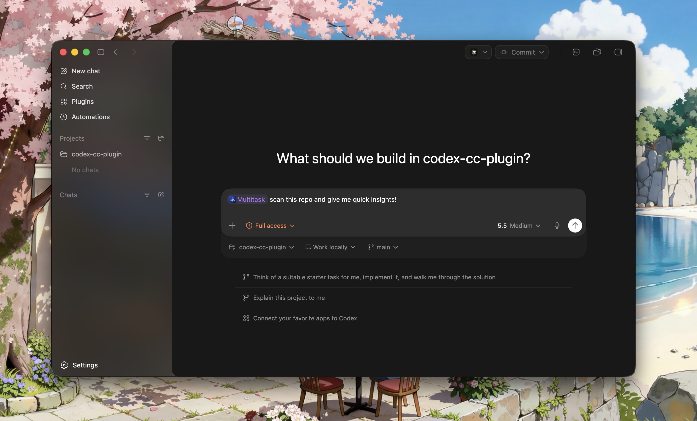

# codex-multitask

[](https://github.com/nikuscs/codex-multitask/actions/workflows/ci.yml)
[](https://developers.openai.com/codex/plugins/build)

`codex-multitask` runs one Codex splitter, validates a JSON worker plan, then fans out parallel `codex exec --json` workers with explicit file ownership.

This plugin is for Codex users who want a first-class Codex skill surface for parallel, file-owned Codex worker runs.



## What You Get

- `multitask-setup` to verify Codex CLI availability and runtime state
- `multitask-plan` to run the splitter only and inspect the worker plan
- `multitask-run` to execute parallel Codex workers from one prompt
- `multitask-status`, `multitask-result`, and `multitask-cancel` for tracked jobs
- Shared-workspace mode by default, with optional `--isolated-workspaces`

## Why This Exists

Native Codex subagents are useful for in-session delegation. `codex-multitask` is different: it is a deterministic external orchestrator that creates an explicit JSON plan, assigns disjoint owned files, runs independent `codex exec --json` workers, and keeps per-worker logs, summaries, and patches.

## Requirements

- Codex CLI installed and on `PATH`
- Codex CLI authenticated
- Node.js `20+`
- Git repository for normal workspace auditing

## Install

### Codex App

Published plugin install, once this repo has a marketplace release:

```sh
codex plugin marketplace add nikuscs/codex-multitask
```

This installs the Multitask plugin for Codex once the repo is published as a marketplace source.

### Local Plugin Checkout

From this repository root:

```sh
codex plugin marketplace add .
```

This works because this repo includes `.agents/plugins/marketplace.json`, matching the sibling `codex-cc-plugin` local marketplace shape. The marketplace name is `codex-multitask-local` so it can coexist with the Claude plugin's `local-repo` marketplace. Restart Codex after adding or changing the local marketplace.

The local marketplace entry points Codex at:

```text
./plugins/multitask
```

### Standalone CLI

Standalone release install, once binaries are published:

```sh
curl -fsSL https://raw.githubusercontent.com/nikuscs/codex-multitask/main/scripts/install.sh | bash
```

That installs:

- `codex-multitask`
- `multitask`

to `~/.local/bin`.

In Codex CLI, use it as a shell command:

```text
!multitask setup
!multitask plan --workers 4 "Split this work"
!multitask run --workers 4 "Implement this change"
```

## First Run

After install, Codex app should expose the plugin skills in the skill picker and plugin directory. Codex may render installed plugin actions with UI labels, but the stable skill names are lowercase.

Look for:

- `multitask-setup`
- `multitask-plan`
- `multitask-run`
- `multitask-status`
- `multitask-result`
- `multitask-cancel`

Try:

```text
Use the skill multitask-setup
```

If Codex runs the skill instead of searching for `SKILL.md`, the plugin is installed correctly.

## Usage

### `multitask-plan`

Runs the splitter only and prints the planned workers without spawning them.

```text
Use the skill multitask-plan to split the auth refactor into 4 workers
```

Standalone CLI:

```sh
codex-multitask plan --workers 4 "Refactor the auth module"
```

### `multitask-run`

Runs the splitter, validates the plan, and fans out Codex workers.

```text
Use the skill multitask-run to implement the docs cleanup in 3 workers
```

Standalone CLI:

```sh
codex-multitask run --workers 4 "Implement the auth refactor"
codex-multitask run --workers 4 --isolated-workspaces "Implement the auth refactor"
```

### `multitask-status`, `multitask-result`, `multitask-cancel`

Use these to inspect, fetch, or stop tracked multitask jobs.

```sh
codex-multitask status <jobId>
codex-multitask result <jobId>
codex-multitask cancel <jobId>
```

## Codex CLI Usage

Use the standalone binary from Codex CLI with `!multitask ...`.

```text
!multitask setup
!multitask plan --workers 4 "Split this task"
!multitask run --workers 4 "Implement this change"
```

## Test

```sh
bun run check
```

```sh
codex-multitask run --workers 4 "Implement the auth refactor"
codex-multitask plan --plan-file plan.md --workers 5
codex-multitask status <jobId>
codex-multitask result <jobId>
codex-multitask cancel <jobId>
```

Default mode runs workers in the primary workspace and audits the final diff. Pass `--isolated-workspaces` to run each worker in a temporary git worktree and copy back only owned files after validation.

## State

Runtime state is stored under:

`~/.codex/cache/multitask-handoff/<workspace-slug>-<hash>/`

Each workspace gets:

- `workspace.json`
- `jobs/<job-id>.json`
- `logs/`
- `sessions/<codex-session-id>.json`
- `runtime.json`

Per-job worker traces are stored under each job directory.

## Hooks

Repo-local hook config is wired through:

- `.codex/config.toml`
- `.codex/hooks.json`

The plugin also ships reference hook config in `plugins/multitask/hooks/hooks.json`.

## Development

Run the full local check suite:

```sh
bun install
bun run check
```

That runs:

- `oxlint`
- `oxfmt --check`
- `node --test tests/runtime.test.mjs`

## Current Status

This repository implements the planned plugin shape from `final_plan.md`: split, validate, fan-out, retry, model fallback, status/result/cancel, shared audit, isolated workspaces, patch application, release packaging, plugin assets, legal docs, and sibling-style README/skill docs.

The remaining work before public release is real-world smoke testing with live `codex exec` across default shared mode and `--isolated-workspaces` in a non-trivial repository.

## Credits

- Sibling implementation: [nikuscs/codex-cc-plugin](https://github.com/nikuscs/codex-cc-plugin)
- This repo adapts that plugin shape for Codex-to-Codex parallel worker orchestration.
